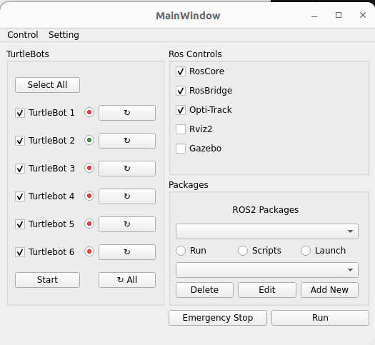
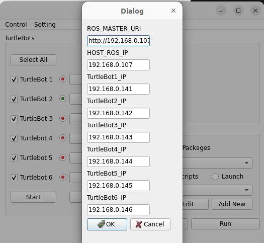

<p align="center">
  
  
</p>


# TurtleManager 🐢

A lightweight GUI to run multi‑TurtleBot experiments with **OptiTrack** on **ROS 2 Foxy** — plus a built‑in **ROS1 ↔ ROS2 rosbridge** workflow for controlling **TurtleBot2 (ROS1)** from a modern ROS 2 environment.

It vendors a small ROS 2 workspace (`turtle_ws/`) and a mapper that turns OptiTrack rigid‑body poses into per‑robot topics `/<robot_ns>/pose`. The GUI handles ROS sourcing and launches everything in `tmux` for you.

---

## ✨ Highlights

- One‑click start/stop of **OptiTrack client + mapper** from the GUI
- Two mapping modes from OptiTrack → robots:
  - **Name mode** — name Motive rigid bodies exactly `robot_2`, `robot_3`, …
  - **First‑seen mode (default)** — first body → `robot_2`, next → `robot_3`, … *(We intentionally skip `robot_1`.)*
- Publishes `geometry_msgs/Pose` on `/<robot_ns>/pose` for each robot
- Patched OptiTrack client that adds a **`name`** field to each rigid body message
- **ROS1 + ROS2 + ros1_bridge**: manage up to 6 TurtleBots, auto‑SSH to each bot, launch per‑bot `roscore`, pass the main PC’s IP, and bridge into your ROS 2 graph

---

## 🧩 Repository Layout

```
TurtleManager/
├─ TurtleManager.py                # GUI launcher (handles sourcing & tmux)
├─ GUI_interface.py
├─ GUI_setting.py
├─ turtle_ws/
│  └─ src/
│     ├─ ros2-mocap_optitrack/     # OptiTrack client (with name support)
│     └─ process_mocap/            # mapper node (mapper_node)
├─ scripts/                        # optional helper scripts
├─ requirements.txt                # Python deps (PyQt6, psutil, numpy, rowan)
├─ LICENSE                         # MIT (or your chosen license)
└─ README.md
```

---

## 🚀 Quick Install (Docker, **two blocks**)

This is the most reliable way: the Docker image contains ROS1, ROS2 Foxy, and rosbridge.  
**Block 1** is run **on the host**; **Block 2** is run **inside the container**.

### Block 1 — on the host

```bash
# Allow the container to open windows on your display
xhost +local:root

# Get the Dockerfile and build the image (no repo checkout needed yet)
curl -fsSL https://raw.githubusercontent.com/Tinnguyen5499/TurtleManager/main/Dockerfile -o Dockerfile
docker build -t turtlemanager .

# Run the container with display + host networking
docker run -it --privileged \
  --env="DISPLAY" \
  --env="QT_X11_NO_MITSHM=1" \
  --volume="/tmp/.X11-unix:/tmp/.X11-unix:rw" \
  --network=host \
  --name turtlemanager \
  turtlemanager
```

> If you prefer to keep it running in the background, add `-d` and attach later with `docker exec -it turtlemanager bash`.

### Block 2 — inside the container

```bash
# --- TurtleManager one-shot setup & run (Ubuntu 20.04 / ROS2 Foxy ) ---
set -Eeuo pipefail
export DEBIAN_FRONTEND=noninteractive
export QT_QPA_PLATFORM=xcb

cat >/root/tm_setup.sh <<'SH'
#!/usr/bin/env bash
set -Eeuo pipefail
export DEBIAN_FRONTEND=noninteractive
export QT_QPA_PLATFORM=xcb

log(){ echo -e "\n>>> $*\n"; }

retry() {
  local n=0 max=5 delay=3
  until "$@"; do
    n=$((n+1))
    if [ "$n" -ge "$max" ]; then echo "Command failed after $n attempts: $*"; break; fi
    echo "Retry $n/$max for: $*"; sleep "$delay"
  done
}

log "1) System packages (Qt/X11 libs, terminal, tools)"
retry apt-get update -y
apt-get install -y \
  python3 python3-pip python3-dev build-essential git tmux sshpass gnome-terminal \
  libx11-xcb1 libxcb1 libxcb-cursor0 libxcb-icccm4 libxcb-image0 \
  libxcb-keysyms1 libxcb-randr0 libxcb-render-util0 libxcb-xfixes0 \
  libxcb-shape0 libxcb-xinerama0 libxcb-xkb1 libxkbcommon-x11-0 \
  libgl1 libglu1-mesa libsm6 libxext6 libglib2.0-0 qtwayland5 \
  python3-colcon-common-extensions python3-rosdep || true

log "2) Upgrade pip tooling"
python3 -m pip install -U pip setuptools wheel sip packaging || true

log "3) Install PyQt6 first (prevents resolver weirdness)"
python3 -m pip install --no-cache-dir "PyQt6>=6.7,<6.8" || \
python3 -m pip install --no-cache-dir "PyQt6>=6.5" || true

log "4) Clone/Update TurtleManager"
cd /root
if [ -d TurtleManager/.git ]; then
  git -C TurtleManager pull --ff-only || true
else
  git clone https://github.com/Tinnguyen5499/TurtleManager || true
fi
cd /root/TurtleManager

log "5) Install Python deps"
python3 -m pip install --no-cache-dir --ignore-installed -r requirements.txt || true

log "6) Build embedded ROS2 workspace (turtle_ws) if Foxy exists"
if [ -f /opt/ros/foxy/setup.bash ]; then
  # Temporarily disable nounset to avoid 'AMENT_TRACE_SETUP_FILES: unbound variable'
  set +u
  source /opt/ros/foxy/setup.bash
  set -u

  cd /root/TurtleManager/turtle_ws
  rosdep init 2>/dev/null || true
  rosdep update || true
  rosdep install --from-paths src --ignore-src -r -y || true
  colcon build --symlink-install || true
  cd /root/TurtleManager
else
  echo "NOTE: /opt/ros/foxy not found, skipping turtle_ws build."
fi

log "7) Launch TurtleManager GUI"
if [ -z "${DISPLAY:-}" ]; then
  echo 'WARNING: $DISPLAY is empty. On the HOST run:  xhost +local:root'
fi
python3 TurtleManager.py || true
SH

chmod +x /root/tm_setup.sh
bash /root/tm_setup.sh

---

## 🎯 Mapping Rules

Two exclusive modes (select in GUI; default **first_seen**):

1) **Name mode**  
   In Motive, rename your rigid bodies to **`robot_2`**, **`robot_3`**, …  
   The mapper forwards poses to those matching namespaces.

2) **First‑seen mode (default)**  
   The first rigid body the client sees is assigned **`robot_2`**, next **`robot_3`**, …  
   Helpful when people forget to rename assets; still skips `robot_1`.

**Published topics**: for each assigned robot, `/<robot_ns>/pose` (`geometry_msgs/Pose`).  
**Raw OptiTrack topic**: `/mocap_rigid_bodies` (`mocap_optitrack_interfaces/RigidBodyArray`)  
Each entry includes: `id`, `valid`, `mean_error`, `pose_stamped`, and **`name`** (from Motive).

---

## 🧪 Verifying Data Flow

With the GUI running OptiTrack:

```bash
# See the raw stream with rigid-body names coming from Motive
ros2 topic echo /mocap_rigid_bodies --qos-reliability best_effort

# See per-robot pose (example for robot_2)
ros2 topic echo /robot_2/pose
```

You should see entries like:

```
rigid_bodies:
- id: 105
  ...
  name: robot_3
```

---

## 🔌 TurtleBot2 + ROS1/ROS2 + rosbridge

- The GUI can SSH into up to **6 TurtleBots**, start their **ROS1 roscore**, and connect them to the main PC’s ROS master.
- The container runs **ros1_bridge**, so your ROS1 bots can be controlled from ROS2 nodes.
- The GUI detects the **host IP** and passes it to the bots for correct networking.

Make sure your TurtleBots can SSH to/from the main machine and that firewalls allow ROS/bridge ports.

---

## 🧯 Troubleshooting

- **Qt “xcb” plugin error (native installs):**  
  Install: `sudo apt-get install -y libxcb-cursor0 libxcb-render0-dev libxcb-shape0-dev libxcb-xfixes0-dev`

- **`/mocap_rigid_bodies` silent or missing:**  
  Ensure Motive is streaming (Multicast/Unicast) and ports **1510/1511** are open.

- **Deserialization/type errors:**  
  Rebuild interfaces:
  ```bash
  cd ~/TurtleManager/turtle_ws
  source /opt/ros/foxy/setup.bash
  rosdep install --from-paths src --ignore-src -r -y
  colcon build --symlink-install --packages-select \
    mocap_optitrack_interfaces mocap_optitrack_client process_mocap
  ```

- **No `/robot_* /pose` updates:**  
  In **first_seen** mode, ensure at least one rigid body is visible.  
  In **name** mode, ensure names match exactly (e.g., `robot_2`).

- **No terminal available:**  
  If `gnome-terminal` isn’t installed, use `tmux attach -t optitrack_session` to view logs.

---

## 🧩 What We Changed in the OptiTrack Client

- Added `string name` to `mocap_optitrack_interfaces/msg/RigidBody.msg`.
- Built an **ID→name** table from the NatNet **data descriptions** (rigid body descriptors).
- Populated `RigidBody.name` when publishing `RigidBodyArray`.
- The `process_mocap` mapper reads this `name` to support **Name mode**.

These modifications are vendored inside `turtle_ws/src/ros2-mocap_optitrack` so users don’t need to patch upstream.

---

## 📦 Developer Notes

- GUI starts a tmux session `optitrack_session` with two panes (client + mapper).
- If you edit ROS code under `turtle_ws/src/`, rebuild:
  ```bash
  cd ~/TurtleManager/turtle_ws
  source /opt/ros/foxy/setup.bash
  colcon build --symlink-install
  ```
- Keep `build/`, `install/`, and `log/` out of version control (`.gitignore`).

---

## 📄 License

MIT License — see `LICENSE` in the repo.  
OptiTrack SDK and ROS dependencies retain their own licenses.

---

## 🙌 Acknowledgements

- OptiTrack NatNet SDK
- ROS 1 / ROS 2 community
- Upstream packages vendored or referenced here